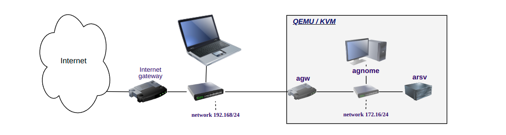

# A DIY Internet router

## Purpose

As a part of tutoring and sharing knowledge, this is a project about creating
your own gateway / router using **Debian Linux** and **Ansible**. This basic solution is primarily intended to be easy to use starting-point with open source building-blocks. However, this solution can be extended and adapted to handle  the most challenging networking solutions. 

To use this solution you need a **Mini-PC** that can run Debian Linux and has at least two network ports. You can also test and play around with this solution in a virtual environment such as QEMU/KVM  ( See [Testing](#testing) )

We use:

 * Debian 12 Linux - server install
 * nftables - firewall
 * dnsmasq  - DHCP & DNS

## Outline
As the common ground for most cases, this router is present in two or more 
networks, and provide means to control the traffic. One network is considered **external**, the other(s) **_internal_**. It is a router because it can route traffic between the networks. To be safe to use, it is also a **_firewall_**. This means that it can be configured to allow only selected traffic. 

## Usage

Create an Ansible playbook for your host, or group of hosts, and apply it. In this simple example all is included in the file `agateway.yml`, including the variables that define the internal network.

```bash
$> ansible-playbook -K agateway-yml
BECOME password: ************
....
PLAY RECAP *****************
agw: ok=8    changed=5  skipped 1 ...
$>  
```

Once the playbook has been applied your gateway is up and running.

## Ansible

Configuring Ansible starts with the file `ansible.cfg`. Here we stipulate what file contains the hosts and what the default administrative used is. We will use `guru` as the admin user, and the local file `inventory.yml` for the hosts and basic variables.

The all-in-one-playbook `agateway.yml`contains tasks and variables used in the setup. The following parameters, defining the network, can be found as variables near the top of the file.

## Configuration


| Variable  | Value      | Purpose                           |
|:---------:|:----------:|:---------------------------------------|
| EXT_NIC   |  enp1s0    | The external network interface         |
| EXT_TCP   |  ["ssh"]   | List of ports open to external         |
| LOCAL_NIC | enp1s0     | The internal network interface         |
| LOCAL_NET | 172.16/24  | The subnet on the internal network     |

**_TBD_**

## Testing

This solution is tested in a virtual environment using QEMU / KVM. The lab has a typical connection to Internet via a gateway and an internal LAN at 192.168/24. The virtual environment mimics the basic setup treating the lab-LAN as Internet while hiding an internal virtual network at 172.16/24.



