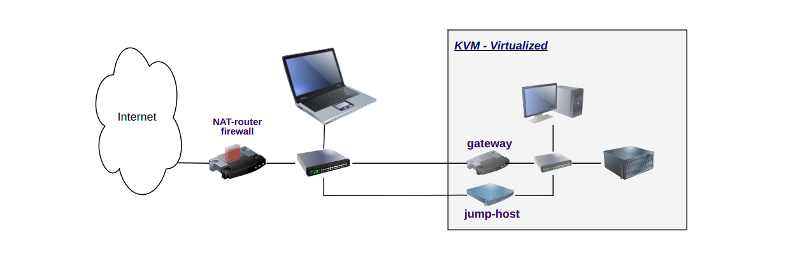

# A DIY Internet router

## Purpose

As a part of tutoring and sharing knowledge, this is a project about creating
your own gateway / router using Ansible. Although the solution can handle 
more than just basic cases, it's primarily intended to be easy to use
with open source building-blocks and easy enough to understand.

## Outline
As the common ground for most cases, this router is present in two or more 
networks, and provide means to control the traffic. It is a router because it 
can route traffic between the networks. To be safe to use, it is also a firewall.
This means that it can be configured to allow selected traffic between selected 
peers. If so configured, the router will also provide DHCP services, which allow
automatic network configuration of hosts.

There are several use-cases for this router. It has been tested in a virtual 
environment covering this. We have a Internet NAT-router with Firewall, where
outgoing traffic only is permitted by default. On the inside we have a virtual 
gateway based on the same recipe, but configured differently. Finally, we have
a so called jump-host. This host only allows the KapTop to connect as a way to 
access the virtual network.

## Ansible

**_TBD_**

## Configuration

**_TBD_**

